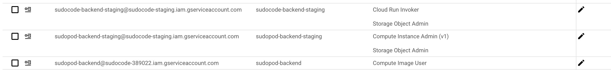

# sudopod

## Running locally
Make sure to run. Note you need to run this command specifically, as you need to mimic the service account.
`gcloud auth application-default login`

`python run_with_watcher.py`

## Create a new base image

### Step 1: Create a VM

Copy this postman request:
https://cloudy-flare-687499.postman.co/workspace/New-Team-Workspace~1db4ed57-2b59-4215-80a0-81e7b73f6d77/request/28102078-9ea3dbd4-be0b-4c99-876c-0ef164f76d8d?ctx=documentation 

### Step 2: Modify VM

Find the instance on GC:
https://console.cloud.google.com/compute/instances?referrer=search&project=pods-staging&supportedpurview=project

SSH into it.

Apply whatever changes are needed (install npm, pip install packages, etc.)

vm_scripts.py shows some basic scripts that have already been applied to the VM.

REMEMBER to use sudo, so that all changes are applied using the superuser.

### Step 3: Make Template Image from VM

After you've applied your changes, stop the VM via the GC console (just Stop it, do not delete it yet)

Once stopped, Navigate [to GC](https://console.cloud.google.com/compute/images?tab=images&project=pods-staging&supportedpurview=project) in order to create an image. Name the image whatever you like, drop the name in `utils/images.py`, and use the VM from Step 2 as the base image.

### Step 4: Update Code to point to Template Image

In `utils/deploy.py` update the "source_image" argument to point to the image name you want. Later on we should make this something we can select.

### Misc:

Note that Randy had to manually update sudopod-staging and sudopod-prod, so that both of them had "Compute Image User" access, in order to use this VM Image. In addition, sudopod needs access to admins or something I don't know

Related:

